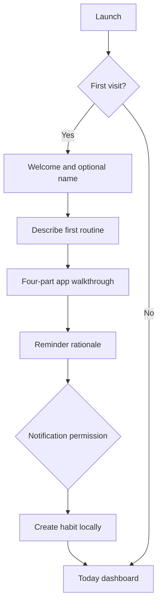
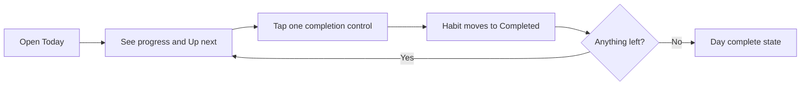
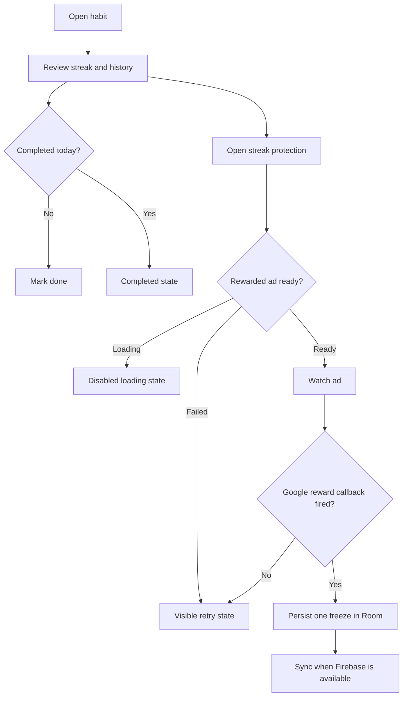

# HabitLoop — Production Information Architecture

## First-use happy path

The user writes the routine in their own words, chooses its visual category, selects scheduled days, and can record why it matters. Templates are presentation shortcuts rather than the limits of what can be tracked. Notification permission is requested only after this context exists.

## Daily happy path

## Habit and reward path

## Primary navigation

- **Today:** daily action and status.
- **Habits:** create routines and open history.
- **Insights:** trends, momentum, recovery and per-routine status.
- **Profile:** identity, overall progress, rewards, backup and preferences.
- **Together:** curated challenges that become real scheduled habits while check-ins remain private.
- **Perks:** reached from Profile or a habit because it is a focused reward flow.
- **Settings:** reached from Profile or Today because it is a low-frequency destination.

## Verified edge cases

- No habits: Today and Habits show a clear starting state.
- Nothing scheduled today: Today presents an intentional rest-day state.
- Weekly/custom routines: Today and reminders include only habits scheduled for that weekday.
- Custom wording: any non-empty habit name up to 48 characters is accepted.
- Empty schedule: creation remains disabled until at least one day is selected.
- Already completed: completion action is removed or disabled.
- Missed exactly one day: one available freeze is consumed automatically.
- More than one missed day: the streak restarts without consuming a freeze.
- Reward not loaded: retry is visible; no silent button failure.
- Ad fails while opening: the user receives an unavailable message and the next ad preloads.
- Cloud sign-out: local data remains and the user receives a warning that an anonymous backup identity may not be recoverable.
- Cloud disconnected: local tracking continues and the Profile/Security surfaces show the disconnected state.
- Challenge joined twice: the join control remains disabled after the first successful creation.
- Advertising: no banner appears on Today or beside a completion control; Challenge discovery contains one labeled placement.
- Offline: habit creation and completion remain local-first.
- Notification declined: onboarding still completes normally.
- Repeated app launch: onboarding is skipped after its completion flag is saved.

## Release blockers

- Replace Google’s test AdMob application and rewarded-unit IDs with production IDs before publishing.
- Add consent handling required for the intended ad regions before requesting production ads.
- Validate notification behavior on Android 13 and 14 devices.
- Run screenshot QA on compact, standard, and large Android phone sizes.
